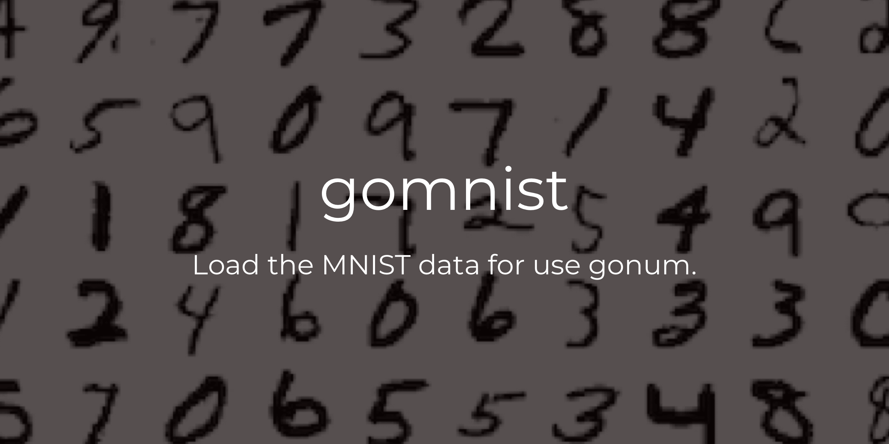

<p align="center">
  
  <h3 align="center">gomnist</h3>
  <p align="center">This package lets you to load the MNIST data set for use with gonum package. It is useful when implementing, for example, deep learning using the gonum package.</p>
</p>

---
 [](https://circleci.com/gh/po3rin/llb2dot) [](https://golangci.com) [](https://codeclimate.com/github/po3rin/gomnist/maintainability)

## What's MNIST ??


[THE MNIST DATABASE](http://yann.lecun.com/exdb/mnist/)

 > The MNIST database of handwritten digits, available from this page, has a training set of 60,000 examples, and a test set of 10,000 examples. It is a subset of a larger set available from NIST. The digits have been size-normalized and centered in a fixed-size image. It is a good database for people who want to try learning techniques and pattern recognition methods on real-world data while spending minimal efforts on preprocessing and formatting.

## Quick Start

```go
package main

import "github.com/po3rin/gomnist"

func main() {
    l := gomnist.NewLoader("./data")
    mnist, err := l.Load()
    if err != nil {
      // error handling ...
    }

    // type MNIST struct {
    //   TrainData   mat.Matrix
    //   TrainLabels mat.Matrix
    //   TestData    mat.Matrix
    //   TestLabels  mat.Matrix
    // }
    mnist.TrainData.At(0, 135)
    // 55
}
```

## Options

Normalization Options is whether to normalize the input image value to a value between 0 and 1 (Default false)

```go
package main

import "github.com/po3rin/gomnist"

func main() {
    l := gomnist.NewLoader("./data", gomnist.Normalization(true))
    mnist, err := l.Load()
    if err != nil {
      // error handling ...
    }
    mnist.TrainData.At(0, 135)
    // 0.21568627450980393
}
```

## Matrix coOptonsation

### Dimension

(Number of images) * (Total number of pixels : 28*28)
* trainData:   60000 - 784
* testData:    10000 - 784

(Number of images) * (Handwritten digits value)
* trainLabels: 60000 - 1
* testLabels:  10000 - 1

## TODO
* Download if mnist file do not exits
