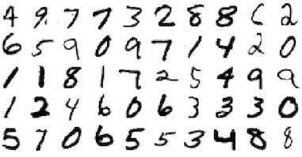

# gomnist

 [](https://golangci.com)

This package lets you to load the MNIST data set for use with gonum package.

## What's MNIST ??



[THE MNIST DATABASE](http://yann.lecun.com/exdb/mnist/)

The MNIST database of handwritten digits, available from this page, has a training set of 60,000 examples, and a test set of 10,000 examples. It is a subset of a larger set available from NIST. The digits have been size-normalized and centered in a fixed-size image

## Quick Start

```go
package main

import "github.com/po3rin/gomnist"

func main() {
    trainData, trainLabels, testData, testLabels, err := gomnist.LoadMat("./data")
}
```

## Matrix configuration

### Dimension

(Number of images) * (Total number of pixels : 28*28)
* trainData:   60000 - 784
* testData:    10000 - 784

(Number of images) * (Handwritten digits value)
* trainLabels: 60000 - 1
* testLabels:  10000 - 1

## TODO
* Normalization Option
* Download if mnist file do not exits
